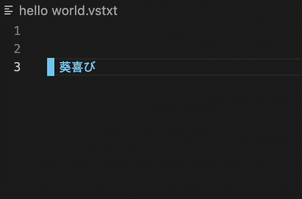
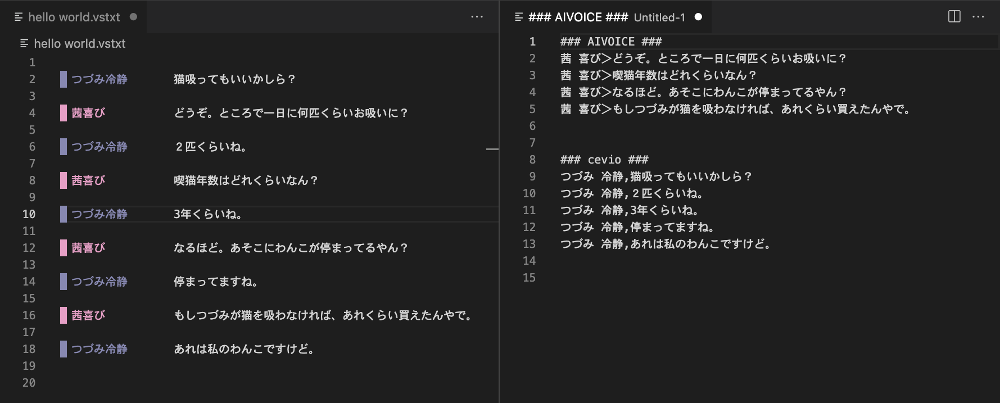

# VoiceScripter

合成音声ソフトの入力支援を行うVisual Studio Code(VSCode)のエクステンションです。
拡張子.vstxtのテキストファイルで動作します。

## Features
- 改行時に次のキャラクターを自動選択
- 各ソフトに合わせて出力形式を変更
- ChatGPTによる会話補完（実験的）

## 使い方
[インストールや使い方](https://wabimochi.github.io/VoiceScripter/)

## Release Notes

### 1.0.0

公開
