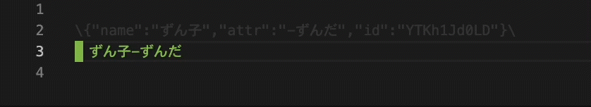

```{toctree}
:hidden:
:maxdepth: 2
クイックスタート <src/quickstart.md>
VSCodeのインストール <src/installation-vscode.md>
VSCodeの設定 <src/setting-vscode.md>
VoiceScripterのインストール <src/installation-voicescripter.md>
VoiceScripterの設定 <src/setting-voicescripter.md>
機能 <src/functions.md>
ChatGPT <src/chatgpt.md>
トラブルシューティング <src/troubleshooting.md>
```

# VoiceScripterとは
合成音声ソフトの入力支援を行うVisual Studio Code(VSCode)のエクステンションです。  
拡張子`.vstxt`のテキストファイルで動作します。

## Features
- 改行時に次のキャラクターを自動選択  
  {.half-width}

- [{kbd}`Tab`]{.win-deco}[{kbd}`Tab`]{.mac-deco}でキャラクター変更  
  

- 各ソフトに合わせて形式を変更して出力
    - クリップボードへの出力
    - ファイルへの出力
    - 一時的なファイル(Untitled)への出力

  

- ChatGPTによる会話補完（実験的）

