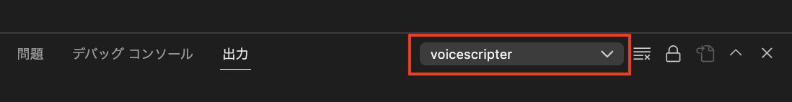

# ChatGPTについて
```{caution}
ChatGPT機能はテキストデータがOpen AIのサーバーに送信されます。個人情報などを入力しないようにしてください。
実際に送信されたテキストを確認するには「表示」→「出力」([{kbd}`Ctrl+Shift+U`]{.win-deco}[{kbd}`Cmd⌘+Shift⇧+U`]{.mac-deco})で出力パネルを開き、VoiceScripterを選択してください。

```

## 設定
最初にOpen AIに登録してAPI Keyを取得する必要があります。API Keyや他の設定については[設定ページのアシスタント項目](#assistant-target)をご覧ください。

(assistant-conversation-mode)=
## 対話モード
コマンドパレット[{kbd}`Ctrl+Shift+P`]{.win-deco}[{kbd}`Cmd⌘+Shift⇧+P`]{.mac-deco}から`対話モード`を選びます。最初に状況を入力できます。空欄でも問題ありませんが、必要な情報を入れると精度の良い返答が得られるかもしれません。
1. 空欄の状態で改行([{kbd}`Enter`]{.win-deco}[{kbd}`Enter`]{.mac-deco})します。  
{.half-width}  
2. 名前部分が`ChatGPTからの応答を待っています…`に変化します。
{.half-width}
3. 返答が自動的に入力されます。  
{.half-width}

状況の文章を変えたい場合は再度`対話モード`を選択してください。

(assistant-generate-description)=
## キャラクターの説明を生成
コマンドパレット[{kbd}`Ctrl+Shift+P`]{.win-deco}[{kbd}`Cmd⌘+Shift⇧+P`]{.mac-deco}から`キャラクターの説明を生成`を選びます。  
現在開いているテキストをChatGPTに投げ、登場するキャラクターの性格などの説明文章を生成してもらいます。生成してもらう文章は英語と日本語が選べます。  
キャラクター設定の`説明`に記入する使い方を想定してます。
英語の方が精度が高くなりやすくトークン消費量も少なくなりますが、キャラクターの説明文章が英語だと対話モードの返答も英語になったりします。その場合は"Output in Japanese"などの適切な指示を与えてください。


## トークンについて
ChatGPT APIは入力した文章量と返答の文章量に応じてトークンを使用します。そして使用したトークン量に応じて課金されます。
```{tip}
今のところ登録した時点から３ヶ月間使用できる$18のクレジットが無料で貰えます。
```
対話モードなど、ChatGPTの機能をONにするとステータスバーにVoiceScripterで消費したトークン数が表示されます。()の中に$0.002 / 1000トークンで計算したコストも表示されます。あくまで目安のため、正しい請求額はOpen AIのページでご確認ください。  
