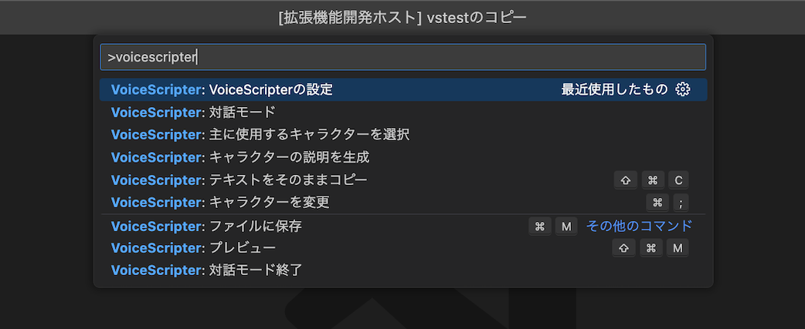

# 機能

## コマンドパレット
[{kbd}`Ctrl+Shift+P`]{.win-deco}[{kbd}`Cmd⌘+Shift⇧+P`]{.mac-deco}で開くコマンドパレットから実行する機能です。一部キーボードショートカットから実行する機能と重複しています。  
コマンドパレットに`voicescripter`と打つとVoiceScripterの機能のみフィルタリングされて表示されます。 


### VoiceScripterの設定
エクステンションの設定画面を開きます。
```{seealso}
[VoiceScripterの設定](#setting-voicescripter-top)
```

### テキストをそのままコピー([{kbd}`Ctrl+Shift+C`]{.win-deco}[{kbd}`Cmd⌘+Shift⇧+C`]{.mac-deco})
選択した範囲のテキストをそのままコピーします。メタセクションのテキストもそのままコピーされます。設定の`クリップボードへのコピー`に関係なくコピーされます。

### ファイルに保存([{kbd}`Ctrl+M`]{.win-deco}[{kbd}`Cmd⌘+M`]{.mac-deco})
現在開いているファイルを、設定の`ファイルへの保存`が有効なアプリ毎に分けてファイルに保存します。ファイル名には自動的にアプリケーション名が追加されて保存されます。

### プレビュー([{kbd}`Ctrl+Shift+M`]{.win-deco}[{kbd}`Cmd⌘+Shift⇧+M`]{.mac-deco})
一時ファイル(Untitled)にアプリケーション毎に分けて出力されます。

### 主に使用するキャラクターを選択
{kbd}`Tab`でキャラクターを変更するときに対象となるキャラクターを選択します。この設定はVSCodeが開いているフォルダ毎に保存されます。

### キャラクターを変更([{kbd}`Ctrl+;`]{.win-deco}[{kbd}`Cmd⌘+;`]{.mac-deco})
キャレットのある行のキャラクターを選択したキャラクターに変更します。
```{tip}
[{kbd}`Alt`]{.win-deco}[{kbd}`Option⌥`]{.mac-deco}+左クリックで複数行にキャレットを置くことができます。
```

### 対話モード
ChatGPTを利用した対話モードを開始します。最初に状況を入力できます。空欄でも問題ありませんが、必要な情報を入れると精度の良い返答が得られるかもしれません。詳細は[ChatGPTについて](#assistant-conversation-mode)をご覧ください。

### 対話モード終了
対話モードを終了します。

### キャラクターの説明を生成
現在開いているテキストをChatGPTに投げ、登場するキャラクターの性格などの説明文章を生成してもらいます。詳細は[ChatGPTについて](#assistant-generate-description)をご覧ください。

---

## キーボードショートカット
キーボードショートカットで実行する機能です。一部コマンドパレットから実行する機能と重複しています。
```{seealso}
[キーボードショートカットの設定](#setting-shortcut)
```


### [{kbd}`Tab`]{.win-deco}[{kbd}`Tab`]{.mac-deco}
キャレットのある行のキャラクターを順方向に変更します。

### [{kbd}`Shift+Tab`]{.win-deco}[{kbd}`Shift⇧+Tab`]{.mac-deco}
キャレットのある行のキャラクターを逆方向に変更します。

### [{kbd}`Ctrl+Tab`]{.win-deco}[{kbd}`Ctrl⌃+Tab`]{.mac-deco}
キャレットのある行の属性を順方向に変更します。キャラクターは変更されません。

### [{kbd}`Ctrl+Shift+Tab`]{.win-deco}[{kbd}`Ctrl⌃+Shift⇧+Tab`]{.mac-deco}
キャレットのある行の属性を逆方向に変更します。キャラクターは変更されません。

### [{kbd}`Ctrl+C`]{.win-deco}[{kbd}`Cmd⌘+C`]{.mac-deco}
選択した範囲のテキストを設定の`クリップボードへのコピー`が有効なアプリの出力ルールに則ってクリップボードにコピーします。  
文の途中まで選択されているときでも、その行は全て選択しているとみなします。何も選択していない場合はキャレットのある行を選択しているとみなしてコピーします。

### [{kbd}`Ctrl+Shift+C`]{.win-deco}[{kbd}`Cmd⌘+Shift⇧+C`]{.mac-deco}
選択した範囲のテキストをそのままコピーします。メタセクションのテキストもそのままコピーされます。設定の`クリップボードへのコピー`に関係なくコピーされます。

### [{kbd}`Ctrl+M`]{.win-deco}[{kbd}`Cmd⌘+M`]{.mac-deco}
現在開いているファイルを、設定の`ファイルへの保存`が有効なアプリ毎に分けてファイルに保存します。ファイル名には自動的にアプリケーション名が追加されて保存されます。

### [{kbd}`Ctrl+Shift+M`]{.win-deco}[{kbd}`Cmd⌘+Shift⇧+M`]{.mac-deco}
一時ファイル(Untitled)にアプリケーション毎に分けて出力されます。

### [{kbd}`Ctrl+;`]{.win-deco}[{kbd}`Cmd⌘+;`]{.mac-deco}
キャレットのある行のキャラクターを選択したキャラクターに変更します。