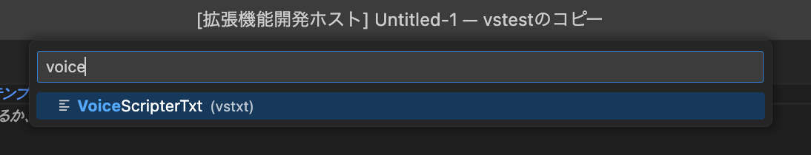
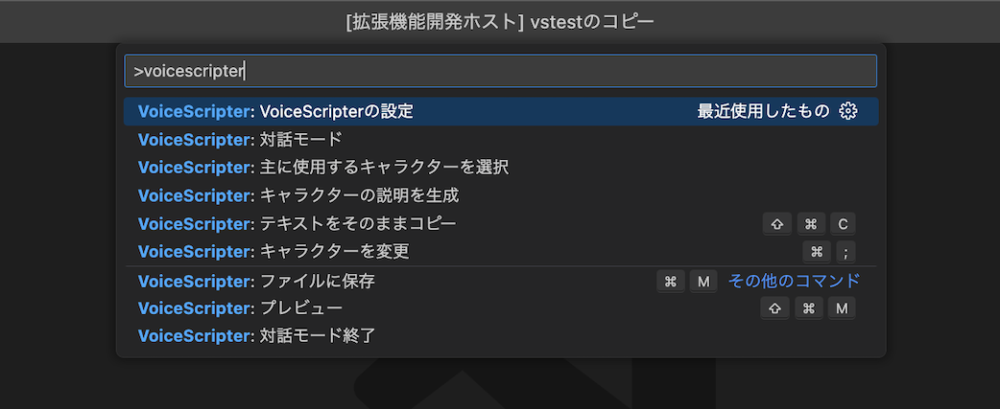

(setting-voicescripter-top)=
# VoiceScripterの設定
## 設定画面を開く
1. 「ファイル」→「新しいテキストファイル」([{kbd}`Ctrl+N`]{.win-deco}[{kbd}`Cmd⌘+N`]{.mac-deco})でファイルを開いた状態にします。
2. 下のステータスバーにある`プレーンテキスト`をクリックします。
{.half-width}
3. 上部に現れる入力欄から`VoiceScripterTxt`を選びます。
{.half-width}
4. [{kbd}`Ctrl+Shift+P`]{.win-deco}[{kbd}`Cmd⌘+Shift⇧+P`]{.mac-deco}でコマンドパレットを開きます。  
5. `voicescripter`と入力し、`VoiceScripterの設定`を選びます。


```{note}
設定は設定画面を閉じたときに保存されます。
```

---

## VoiceScripter
エクステンション全体の設定です。

### メタセクションの不透明度
キャラクター名などのメタ情報の不透明度を設定します。

### キャラクター名の長さ
行の頭につくキャラクター名＋属性名の表示文字数です。ここで指定した長さを超える場合、あふれた分は非表示になります。

### クリップボードへのコピーをアプリ毎に分ける
クリップボードにコピーする際、アプリ毎に分けてコピーします。複数のアプリがある場合、Windowsであれば{kbd}`Win+V`で履歴として呼び出せます。

---
(assistant-target)=
## アシスタント
ChatGPTの設定です。

### API Key
Open AIのAPIのページから取得できる、`sk-`で始まる文字列を設定します。API Keyは他人に知られないよう注意してください。

### 最大行数
ChatGPTにはキャレットのある行から上に、ここで指定した行数までのテキストを送ります。

### 対話モードのプロンプト
ChatGPTに送るプロンプトです。一般的にプロンプトは英語の方が精度が良いと言われています。ただし「出力は日本語で」のような指示を入れないと返答も英語になりやすいです。

---

## アプリ
アプリケーション毎の出力ルールなどを設定します。

### アプリケーション名
アプリケーション名を入力します。任意の名前で大丈夫です。ただし重複しないようにしてください。

### クリップボードへのコピー
チェックを入れると[{kbd}`Ctrl+C`]{.win-deco}[{kbd}`Cmd⌘+C`]{.mac-deco}でクリップボードにコピーする対象になります。

### ファイルへの保存
チェックを入れると[{kbd}`Ctrl+M`]{.win-deco}[{kbd}`Cmd⌘+M`]{.mac-deco}でファイルに保存する対象になります。

### 保存するファイルの拡張子
ファイルへ保存する際の拡張子です。

### API
現在は使いません。

### 出力ルール
クリップボードやファイルへ出力する際の成形ルールです。変数として`$name`, `$attr`, `$body`を使用してください。下にある出力プレビューでどのように出力されるか確認できます。

---

## キャラクター
キャラクターの設定です。

### キャラクター名
キャラクター名を入力します。各アプリケーションで使用している名前と同じものを入力します。重複しないようにしてください。

### 色
キャラクター名の文字色です。使用したい色が無い場合はその他からRGB値などで指定してください。

### アプリケーション名
アプリタブで設定したアプリケーション名を選択します。ここで紐付けたアプリの出力ルールでクリップボードやファイルに出力されます。

### 説明
ChatGPTに送るキャラクターの説明です。空欄でも大丈夫です。

### 属性-属性名
属性名（喜び、元気など）を入力します。同キャラクター内で重複しないようにしてください。

### 属性-色
キャラクターと違う色にする場合は指定してください。