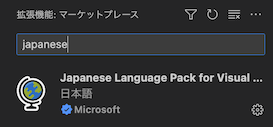

# VSCodeの設定
VSCodeの設定方法などです。一般的な説明なので知っている方は飛ばして問題ありません。

## 日本語化
1. 左のアクティビティバーからエクステンションのマーケットプレースを開きます。  

2. `japanese`と検索するとMicrosoftが提供する日本語言語パックが出てくるのでインストールして再起動します。  

(setting-shortcut)=
## キーボードショートカット
1. 左下の⚙️歯車アイコンから`キーボードショートカット`を選択します。  

2. 変更したい項目をダブルクリックするか🖋ペンアイコンをクリックして変更します。VoiceScripter関連のキーを変更する場合は`voicescripter`で検索してください。

## フォント
1. 左下の⚙️歯車アイコンから`設定`を選択します。
2. `editor.fontFamily`と検索します。
3. `Editor: Font Family`を変更します。他にも`Editor: Font Size`などでフォントサイズを変更することもできます。
