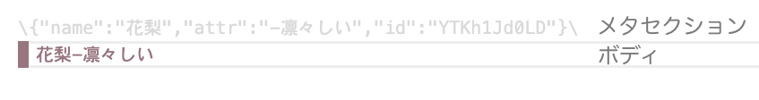

# トラブルシューティング

```{caution}
`.vstxt`は`\`から始まるメタ情報が書いてあるメタセクションとセリフが書いてあるボディで構成されます。  
  
そのためボディに`\`を使用しないでください。  
また、メタセクションは可能な限り編集できないようにしていますが、[{kbd}`Alt+↑`]{.win-deco}[{kbd}`Option⌥+↑`]{.mac-deco}などの操作で壊すこともできてしまいます。  
もし壊れてしまった場合はすぐにUndo([{kbd}`Ctrl+Z`]{.win-deco}[{kbd}`Cmd⌘+Z`]{.mac-deco})するか、ステータスバーの`VoiceScripterTxt`をクリックして`プレーンテキスト`にしてから手動で修復してください。
```

## [{kbd}`Tab`]{.win-deco}[{kbd}`Tab`]{.mac-deco}を押してもキャラクターが変化しない
`主に使用するキャラクターを選択`で選択されていない可能性があります。  
コマンドパレット([{kbd}`Ctrl+Shift+P`]{.win-deco}[{kbd}`Cmd⌘+Shift⇧+P`]{.mac-deco})から`主に使用するキャラクターを選択`を選び、チェックが入っているか確認してください。

## 「ChatGPTからの応答を待っています…」から変化しない
状況により30秒くらいレスポンスが遅れることもあります。  
それ以上待っても変化が無い場合は`ChatGPTからの応答を待っています…`の行を{kbd}`Backspace`で消して再度お試しください。
